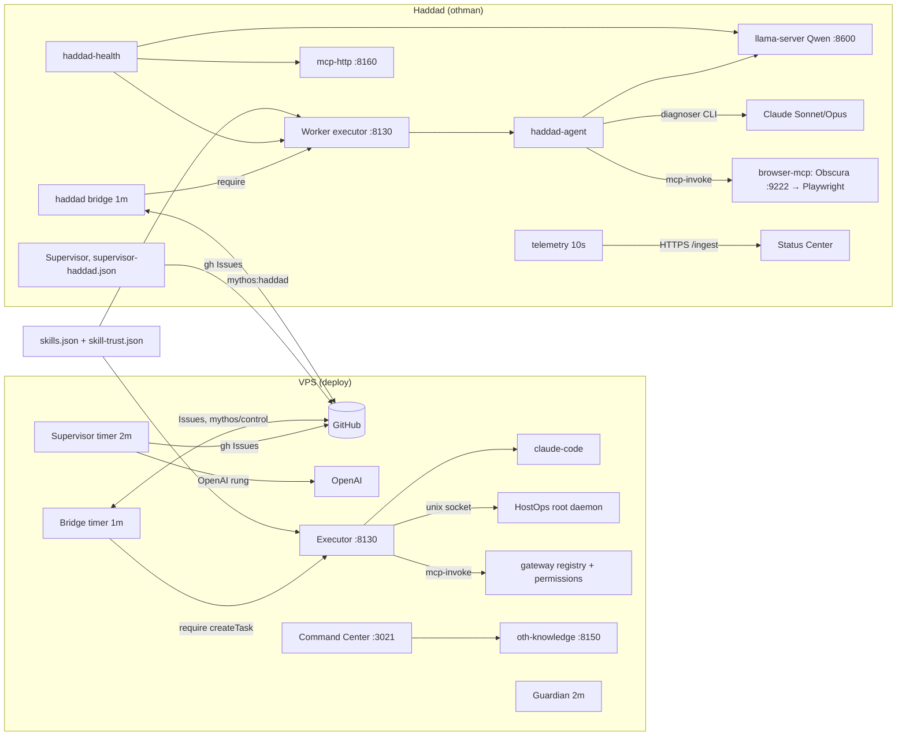

# MYTHOS OS / Orchestration — the verification matrix

`bin/mythos-verify-matrix.js` is the machine-verifiable definition of "100 % verified". It is a list of
36 gates, and each gate is a **probe that measures now**, on the host, against the commit the live
checkout runs. The rules the probes follow:

- **PASS only when the property was measured.** A probe that cannot reach what it must measure answers
  `BLOCKED` (with the owner action) or `UNMEASURED` — never PASS. `--quick` skips the suites and their
  gates answer `UNMEASURED`, so a quick run can never report 100 %.
- **No stale green.** Suites are run, not read from a log. A Guardian run counts only when its commit
  has the same Guardian inputs as HEAD. A sweep counts only when its commit has the same code as HEAD.
  An E2E record counts only when the task's `runtime.head` has the same worker-loaded code as HEAD.
- **No unexplained exclusion.** A failing suite is accepted only when `config/verify-matrix.json` names
  it with a reason class and evidence; a suite with named `labels` passes only if exactly those
  assertions fail. `load_sensitive` suites must be green when re-run standalone.
- **The model's word is not evidence.** E2E gates read the executor's own records (`status.json`,
  `events.log`, the report's `tool_trace`, the MCP audit log) — the backend that served a browser call
  is taken from the trace entry the adapter wrote (PR #525), never from the report's prose.

```
node projects/mythos-haddad/bin/mythos-verify-matrix.js \
  --sweep <sweep.tsv> --sweep-commit <sha> \
  --e2e A=<issue> --e2e B=<issue> --e2e C=<issue> \
  [--json] [--out report.json] [--quick]
```

Exit code 0 only when every gate 1–35 is PASS (gate 36).

## Gates

| # | Gate | Probe |
|---|---|---|
| 1 | Repository integrity | `git fsck --connectivity-only` on the live checkout |
| 2 | Git synchronization | branch `main`, clean, HEAD = origin/main (after fetch) |
| 3 | Runtime | `haddad-health.js --json` status PASS |
| 4 | Orchestration | orchestration-core (2 VPS-host assertions excepted by label), core-wiring, autonomous-campaign, mos-e2e-lifecycle |
| 5 | Task creation | executor suite, github-issues |
| 6 | Task persistence | lifecycle |
| 7 | Task assignment | github-bridge, bridge-timer, action-resolution |
| 8 | Worker execution | worker `/health.code_identity` = HEAD and verified; tool-runner; E2E A |
| 9 | Executor routing | lane-routing, model-selection-policy, ai-team |
| 10 | Provider selection | delegation, free-llm-selector, advisory-profile |
| 11 | Qwen execution | health `ai_runtime` (GPU layers); E2E A |
| 12 | OpenAI fallback | orchestrator-openai suite; live rung is the VPS Supervisor's → BLOCKED on Haddad |
| 13 | Claude integration | health `claude_code`; escalation-events |
| 14 | Bridge communication | bridge timer active; github-bridge |
| 15 | Supervisor control | supervisor suite; a supervisor decision posted on a supervised Issue within 24 h |
| 16 | Retry/deadline | transient-hangup, supervised-loop, haddad-runtime |
| 17 | Failure handling | report-normalization; the "cancelling a BLOCKED task is reported, not thrown" assertion; E2E C |
| 18 | Single settlement | the `DUPLICATE_SETTLEMENT` assertions of the executor suite |
| 19 | Permission governance | governance-invariant, gateway-boundary |
| 20 | Skill trust | every executor skill ACCEPT through `skills.loadRegistry()`; `skill-trust-cli verify`; skill-trust suite |
| 21 | MCP governance | health `mcp`; mcp-ecosystem; haddad-mcp |
| 22 | Browser governance | `browser.read` ALLOW for `executor` only, `browser.interact` absent; browser-governed |
| 23 | Obscura | health `browser`; unauthenticated CDP → 401; browser-mcp |
| 24 | Playwright fallback | health `browser` (fallback AVAILABLE); E2E B served by `playwright` |
| 25 | Security boundaries | every TCP listener on the allowlist (loopback fixtures of a running suite named as such); no passwordless sudo; CDP 401 |
| 26 | Secret handling | secret files 0600, no stray token file; gitleaks tree hits only in test fixtures / allowlisted model ids |
| 27 | Audit trail | MCP audit log present; E2E A audited |
| 28 | Event integrity | orchestration-core, escalation-events |
| 29 | Health | every health check PASS |
| 30 | Recovery | the four user units restart automatically; the worker rebuild reproduces production (PR #528) |
| 31 | HostOps boundary | allowlist/controlled/group-refresh suites; the root daemon is VPS-only → BLOCKED on Haddad |
| 32 | Guardian CI | a successful Guardian run on a tree identical to HEAD for every Guardian input |
| 33 | Regression | the given sweep covers HEAD's code; every nonzero suite classified |
| 34 | E2E | A (Obscura primary), B (Obscura down → Playwright), C (all backends down → controlled failure) |
| 35 | Documentation | the operator documents exist |
| 36 | Production readiness | every gate 1–35 PASS |

E2E evidence per Issue (from the executor store, not from GitHub prose): exactly one settlement; at most 3
executions (no retry storm); governed `mcp_invoke` events; the backend recorded by the adapter; the CDP
token absent from the task record and the audit log. A: COMPLETED on `obscura`. B: COMPLETED on
`playwright`. C: no browser call succeeded and the task did not end COMPLETED.

## Dependency graph (measured 2026-09-29, main `a32dc03d`)



Task state machine (`lib/state.js`): QUEUED → RUNNING → {COMPLETED | FAILED | BLOCKED | WAITING_RETRY |
WAITING_FOR_QUOTA | CANCELLED}; FAILED and BLOCKED leave only by an explicit re-queue; COMPLETED and
CANCELLED are final; a settled state cannot be written twice (`DUPLICATE_SETTLEMENT`, PR #525).
Retry: `max_retries` 3, backoff 60 s × 4ⁿ capped at 30 min; haddad-agent hard deadline, 12 iterations,
24 tool calls, 2 repair rounds, 2 runtime recoveries per execution. Supervisor: 3 attempts, recovery
limit per config, hard Qwen deadline 2400 s, idempotent settlement (`duplicate_settle_ignored`).

## Known boundaries (BLOCKED by design on Haddad)

- **OpenAI fallback** — no OpenAI credential on Haddad; the OpenAI rung belongs to the VPS Supervisor.
- **HostOps** — the root daemon and its socket exist only on the VPS (#479).
- **VPS** — `deploy` is in the `docker` group (root-equivalent), re-confirmed by the VPS Final Gate
  (run 36563839852, 2026-09-29); remediation is root-only.
